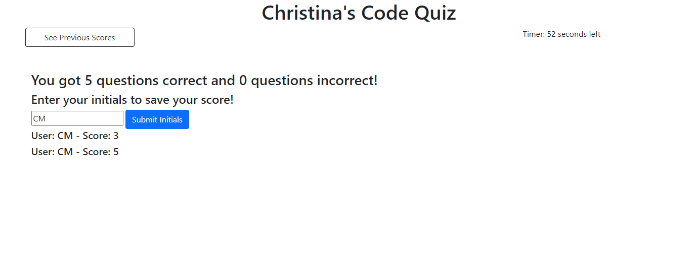

# CODE QUIZ

## DESCRIPTION

This webpage was designed to generate a Javascript quiz with a timer and a score record.

When the user clicks start, the timer starts counting down from 60 seconds. If the user gets an answer wrong, 10 seconds are subtracted from the timer.

The number of correct and incorrect answers are recorded and shown at the end of the quiz. The user has the option to save their initials and score. Once saved, the user is shown other scores from this quiz.

## WHAT WAS DONE?

The Javascript document is where most of the work was done. Some bootstrap and css are also used.

There are three different UIs that the user is shown depending on the stage of the quiz. These are displayed or hidden (for example, when the start button is clicked, it is hidden and the quiz block is shown.)

## DEPLOYED!

This project was successfully deployed. Need proof? Click the links below to give it a try.

[Code Quiz](https://cmoss703.github.io/code-quiz/)

[Github Repo](https://github.com/cmoss703/code-quiz)

## PROOF

Here are some screenshots of my webpage in action:

